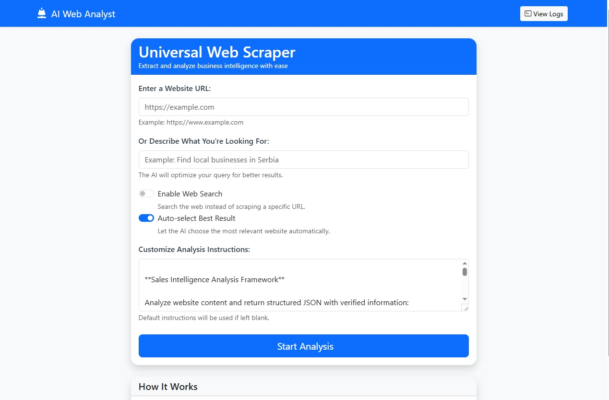
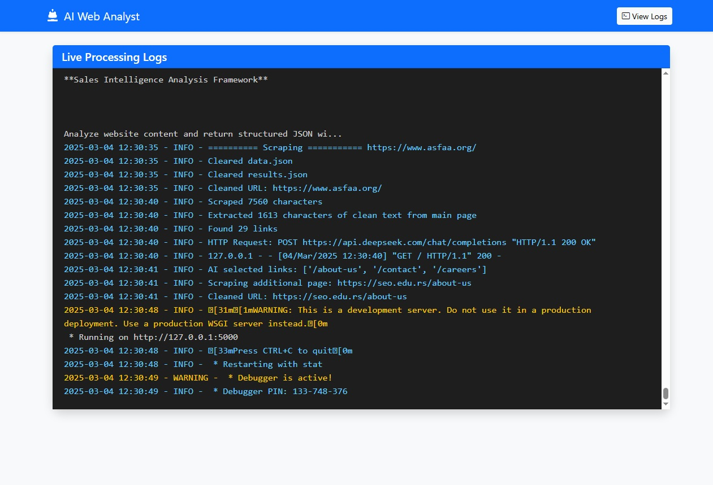
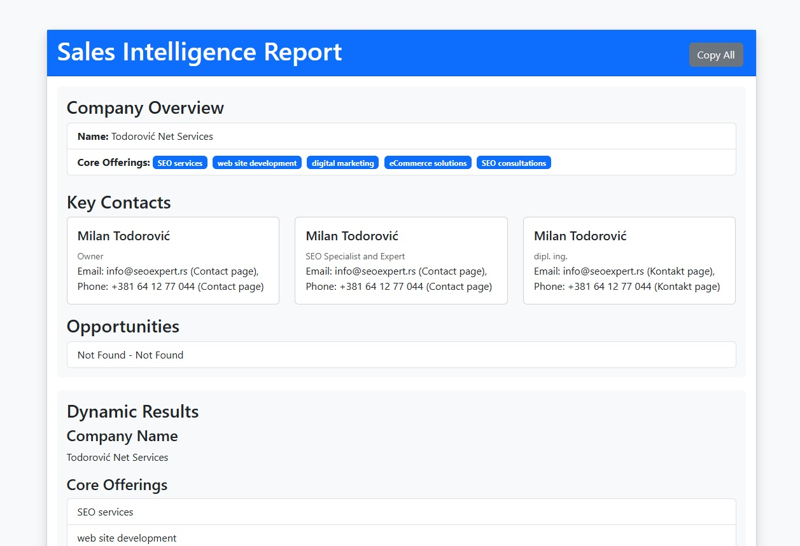

# 🔍 AI Web Analyst 🤖

**A smart web scraping & business intelligence platform powered by AI**  
*Extract insights, find decision-makers, and discover sales opportunities automatically*

[](https://flask.palletsprojects.com/)
[](https://playwright.dev/)
[](https://deepseek.com/)

## 🖼️ Project Screenshots

### Main Interface


### Search Results (to select manually)


### Live Logs


### Analysis Results



## 🌟 Features

- **🕸️ AI-Powered Web Scraping**  
  Intelligent content extraction with anti-bot detection measures
- **🔎 Smart Search Optimization**  
  Transform natural language queries into optimized search strings
- **📊 Automated Business Analysis**  
  Extract company info, leadership contacts, and market insights
- **📈 Opportunity Identification**  
  Detect expansion signals and tech stack information
- **📜 Real-time Logging**  
  Monitor scraping and analysis processes live
- **📂 JSON Data Management**  
  Structured storage of scraped data and analysis results

## 🛠️ Tech Stack & Libraries

### Core Components
| Category       | Technologies                                                                 |
|----------------|------------------------------------------------------------------------------|
| **AI Engine**  | DeepSeek API, JSON processing, Natural Language Understanding               |
| **Web Scraping** | Playwright, BeautifulSoup4, Requests, Advanced anti-detection techniques   |
| **Backend**    | Flask, REST API, Session management, Logging                                |
| **Search**     | DuckDuckGo Search API, Query optimization                                   |
| **Frontend**   | Bootstrap 5, Jinja2 templating, Real-time updates                           |
| **Security**   | Environment variables, Rate limiting, Error handling                        |

## 🚀 Getting Started

### 📦 Installation

1. **Clone repository**
   ```bash
   git clone https://github.com/yourusername/ai-web-analyst.git
   cd ai-web-analyst
   ```
2. **Set up environment**
Create .env file:

env
```bash
DEEPSEEK_API_KEY=your_api_key_here
FLASK_APP=app.py
FLASK_ENV=development
```
3. **Install dependencies**

```bash
pip install -r requirements.txt
```
4. **Launch application**

```bash
flask run
```

## 🖥️ Usage

### Web Mode

```bash
# Start local server
flask run --host=0.0.0.0 --port=5000
```

**Visit http://localhost:5000 in your browser**


## 🧠 Key Concepts
### 🤖 AI Integration Architecture

```mermaid

graph LR
A[User Input] --> B{Web Search/URL}
B --> C[Scraping Engine]
C --> D[AI Processing]
D --> E[Data Enrichment]
E --> F[Insight Generation]
F --> G[Results Visualization]
🔄 Data Flow
Input → 2. Content Harvesting → 3. AI Analysis → 4. Data Validation → 5. Insight Packaging
```

### 📂 Project Structure

```
ai-web-analyst/
├── ai_integration.py    # 🤖 Core AI processing logic
├── scraper.py           # 🕷️ Web scraping & search implementation
├── routes.py            # 🌐 Flask web routes & controllers
├── utils.py             # 📦 Data management utilities
├── templates/           # 🎨 Frontend components
│   ├── base.html        # 🏗️ Master template
│   ├── index.html       # 🏠 Main interface
│   ├── results.html     # 📊 Analysis visualization
│   └── logs.html        # 📜 Real-time monitoring
└── requirements.txt     # 📦 Dependency manifest
```

### 🚧 Important Notes
**Rate Limiting:** ⚠️ API calls are throttled to prevent overuse

**Ethical Scraping:** ✅ Respect robots.txt and website terms of service

**Data Privacy:** 🔒 All scraped data stays local by default


### 🤝 Contributing
We welcome contributions! Please follow our contribution guidelines.

### 📜 License
MIT License - See LICENSE for details

Made with ❤️ by Meta Meta
Empowering sales teams with AI-driven insights 🚀